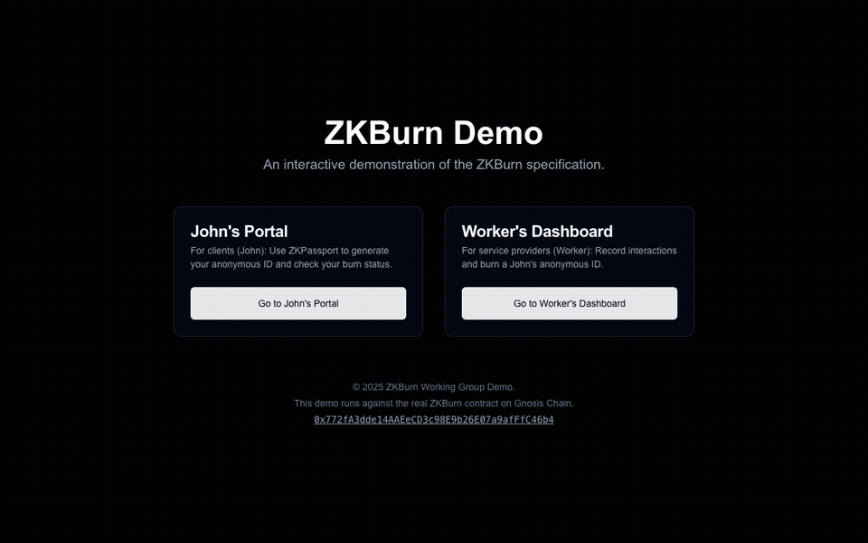
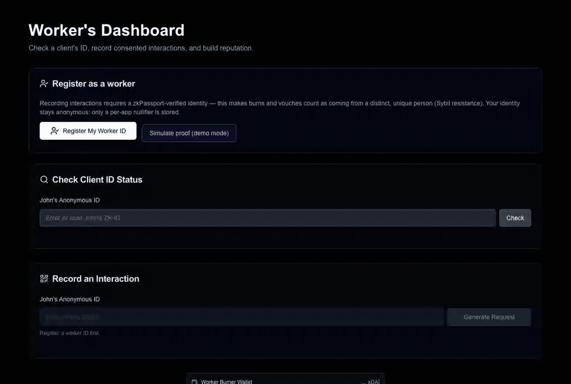
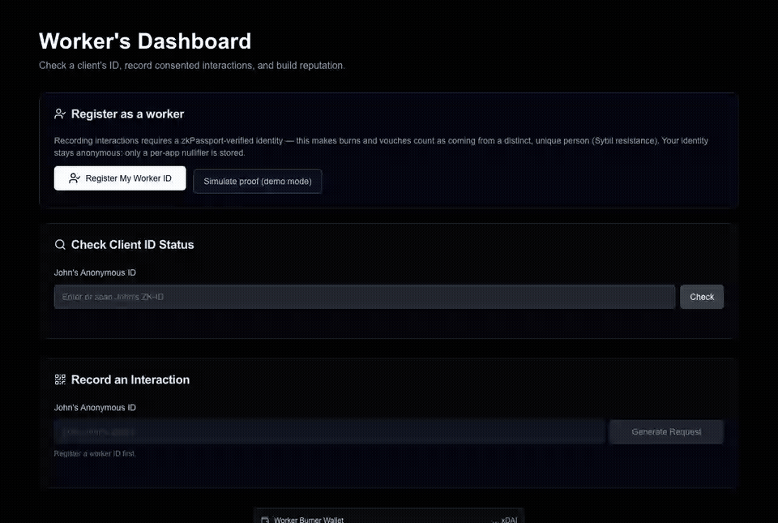
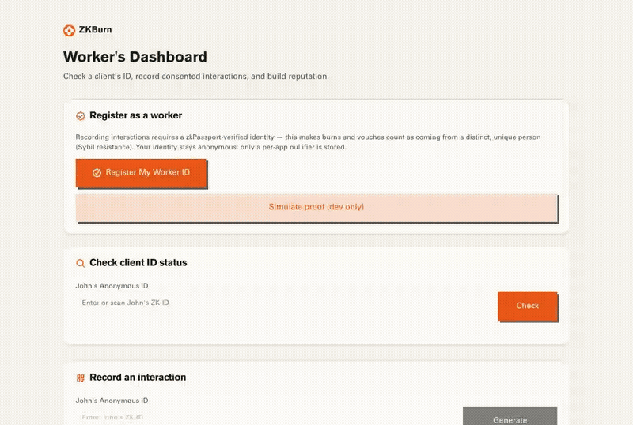

# ZKBurn

A real, decentralized implementation of the [ZKBurn concept](https://zk-burn.vercel.app/) — *"Empowering Sex Workers with Verifiable, Anonymous Safety."*

The original site is a client-side mock with no chain and no real ZK. This repo implements the full feature set end-to-end:

- **Live site:** https://ronturetzky.github.io/zkburn-decentralized/ (static export on GitHub Pages, talks straight to Gnosis).
- **Anonymous identity** — both clients ("John") *and* workers prove they are a real, unique person with [zkPassport](https://zkpassport.id) (zero-knowledge proofs over government IDs). The proof's *scoped nullifier* becomes their id: unique per person per app, unlinkable to their real identity. Requiring workers to be verified gives the reputation Sybil resistance.
- **Mutual-consent interactions** — a worker records an interaction on-chain; John confirms it from the wallet bound to his id. Both parties must act — nobody can fabricate an interaction alone.
- **Burns & vouches, retractable** — each confirmed interaction grants the worker one burn (flag, with a note) and one vouch. Status reports *distinct* burners/vouchers, not just raw counts. A worker can **retract** their own burn/vouch (false-flag correction); the record is kept but the count is adjusted.
- **No backend, no admin** — the contract has no owner and the static web app talks straight to Gnosis Chain. Nothing can be deleted or edited by anyone, including us.

See [`docs/CONTRACT-REVIEW.md`](docs/CONTRACT-REVIEW.md) for the V1→V2 flow review (what was simplified and hardened).

## Deployed contract

| | |
|---|---|
| Network | Gnosis Chain (id 100) |
| Contract (V2) | [`0xE8bE1A3C20a484c66668c500E6306968f92ceb88`](https://gnosis.blockscout.com/address/0xE8bE1A3C20a484c66668c500E6306968f92ceb88) |
| Verified | Blockscout (solc 0.8.35) + Sourcify full match |
| Deployed via | [etherform](https://github.com/BreadchainCoop/etherform) `_deploy-testnet.yml` reusable workflow (`workflow_dispatch`), pinned to commit `4e78fbb` |
| Config | domain `zkburn.app`, scope `zkburn-v1`, verifier `0x1D000001000EFD9a6371f4d90bB8920D5431c0D8` |
| Prior (V1) | [`0x772fA3dde14AAEeCD3c98E9b26E07a9afFfC46b4`](https://gnosis.blockscout.com/address/0x772fA3dde14AAEeCD3c98E9b26E07a9afFfC46b4) (demo-grade; superseded) |

## Demos

Recorded end-to-end against the **live Gnosis V2 contract** — every step is a real transaction. The QR in flows 1–2 is a genuine zkPassport request, completable with the ZKPassport mobile app; the recordings finish via the clearly-labeled demo-mode simulated proof (a phone can't scan a headless browser):

| Flow | GIF |
|---|---|
| 1. John registers (zkPassport QR → JohnID) |  |
| 2. Worker registers (Sybil resistance) + checks a client |  |
| 3. Worker records an interaction → John authorizes |  |
| 4. Worker vouches, burns w/ note (status → BURNED), then retracts |  |

Reproduce with `demos/record-demos.mjs` (Playwright): fund two burner keys with a little xDAI, then
`DEMOJ_PK=0x… DEMOW_PK=0x… BASE_URL=http://localhost:3101 node demos/record-demos.mjs`.

## Repo layout

```
foundry.toml          # Foundry config at root (etherform's workflows expect this)
contracts/src/        # ZKBurn.sol + zkPassport interface
contracts/script/     # Deploy.s.sol (env-driven)
contracts/test/       # Foundry tests
web/                  # Next.js dapp — Breadchain UI (@breadcoop/ui, Tailwind v4)
.github/              # etherform CI/CD + GitHub Pages deploy
```

## UI & wallet model

The dapp uses Breadchain's design system [`@breadcoop/ui`](https://github.com/BreadchainCoop/bread-ui-kit) (paper theme, Pogaca type, orange/blue/jade) — the kit provides the branded `Button`/typography/`Logo`; form primitives are built on its tokens. Following the kit's own consumer pattern (crowdstake.fun), the app **owns its wallet layer** rather than mounting the kit's connect flow.

Each visitor gets an **anonymous, in-browser session wallet** (a viem burner in `localStorage`) — deliberately, not a "connect MetaMask" flow: this is a safety tool where linking a doxxable personal wallet would defeat the purpose. Fund it with a little xDAI to transact. (A gasless relayer/paymaster so users need no xDAI is the main remaining productionization step.)

## Trust model & the "optimistic" mode

zkPassport's `RootVerifier` lives at the CREATE2-deterministic address `0x1D000001000EFD9a6371f4d90bB8920D5431c0D8` on every chain they've deployed to (Ethereum, Base, Sepolia today). **It is not yet deployed on Gnosis.**

`ZKBurn.register` therefore auto-detects: if verifier code exists at that address it performs full on-chain ZK verification (`zkVerified = true`); otherwise it still enforces the proof's scope binding (domain + scope hashes in the public inputs) and freshness on-chain, extracts the nullifier from the canonical public-input layout, and registers *optimistically* (`zkVerified = false`, shown honestly in the UI). The day zkPassport deploys their verifier to Gnosis (they do so [on request](mailto:company@zkpassport.id)), every new registration is fully verified — no redeploy, no migration.

The UI distinguishes three registration grades: **verified** (on-chain ZK), **optimistic** (real zkPassport proof, verifier not yet on Gnosis), and **simulated** (demo-mode synthetic params for recordings/testing — never presented as verified).

## Running the app

```sh
cd web
pnpm install
cp .env.local.example .env.local   # set NEXT_PUBLIC_ZKBURN_ADDRESS
pnpm dev
```

Users get an in-browser burner wallet per role (John / Worker), stored in localStorage. Fund it with a little xDAI to transact. Real passport registration requires the ZKPassport mobile app (dev mode supports mock "ZKR" passports).

## Contracts

```sh
forge build
forge test -vv
```

Deploys run through [etherform](https://github.com/BreadchainCoop/etherform) reusable GitHub Actions (`.github/workflows/cicd.yml`): CI on every push; deployment to Gnosis mainnet + Blockscout verification on `workflow_dispatch`, with `PRIVATE_KEY`/`RPC_URL` repo secrets.
